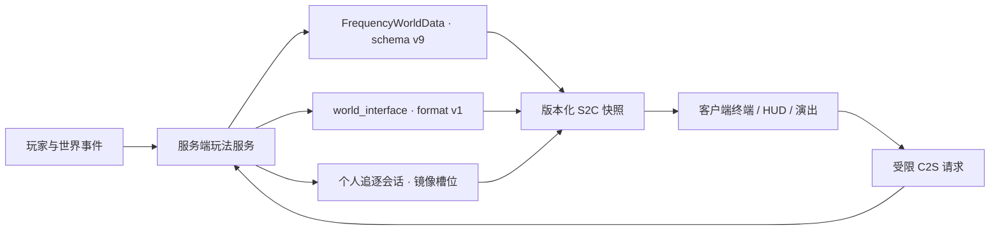

# Beta 0.2.1 架构说明

本文描述 `0.2.1-beta` 当前实现，不再把 Alpha 阶段的四阶段“异象主体”终局当成现行架构。

## 工程基线

| 项目 | 当前值 |
| --- | --- |
| Minecraft | 1.21.11 |
| Fabric Loader | 0.19.3 |
| Fabric API | 0.141.4+1.21.11 |
| Fabric Loom | 1.17.14 |
| Gradle Wrapper | 9.5.1 |
| Java | 21 |
| MOD 版本 | 0.2.1-beta |
| License | All Rights Reserved |

源码按 `main`、`client`、`test`、`gametest` 四个 source set 分层。服务端保存进度并裁决玩法，客户端只负责呈现、输入和本地结局演出；客户端请求不能直接写入权威状态。

## 权威数据与协议

| 契约 | 版本 |
| --- | ---: |
| 世界/终端 schema | v9 |
| 终端主快照 | v8 |
| 工具快照 | v4 |
| 导航 | v6 |
| 异象生命周期 | v3 |
| Debug | v3 |
| 世界接口状态格式 | v1 |
| 世界接口网络协议 | v1 |
| 诗篇开始通道 | `world_interface_poem_start_v2` |

`FrequencyWorldData` 是世界级主线、文件、发现和兼容迁移的事实源。世界接口使用独立 `world_interface` 持久化根与格式 v1；旧终局字段只用于兼容清理或历史读取，不能驱动新终局。

所有版本化载荷都必须先完成维度、玩家、持有物、会话和权限校验。旧客户端只能走明确兼容分支，未知格式应安全拒绝，而不是猜测字段含义。

## 终端与主线

- 玩家页面固定为 `HOME / TOOLS / RECORDS / FILES`；wire 模式保留 `SIGNAL / FILES` 以兼容协议。
- 六个工具为住所、矿物、传送门、天气、导航、要塞。
- 文件解锁、异象目录和主线目标均由服务端生成快照；UI 不自行推导权威完成状态。
- 四份破损文件的发现状态属于世界；阅读状态和完整日记权限属于终端主人。发现数只控制日记标题恢复，阅读数只控制 0%—100% 解锁进度。
- 第一位完成四份阅读的玩家创建一次共享主世界裂缝；之后的玩家仍需独立读完，但复用既有裂缝。
- 导航要求服务端记录三次真实末影之眼投掷，避免客户端伪造路线。
- 当前生存目标链以“击败世界接口”收尾，不再引用旧“异象主体”。

## 异象与个人追逐边界

当前可触发目录有 16 项，分为 1—5 阶段。服务器决定个人阶段、滑动候选池、最近三次排除、新内容权重、冷却与成功历史；声音、着色、输入干扰等个人效果只发给目标客户端。共享型异象可以改变附近实体、门或玩家位置，但不会把目标玩家的阶段和冷却写给其他人。`disconnected_base`、`watcher_orbit`、`rework_probe`、`hostile_echo` 仅保留为历史/调试名称映射。

个人追逐使用三层服务端状态：

- `allowedForm` 由主线与活动证明给出最高许可；
- `actualForm` 由已解决追逐数确定，每次成功最多前进一级；
- `pendingChase` 只保存下一场，不积累跨门槛追逐债务。

每个形态必须先通过异象写入安全演示，再由终端写入警告并等待至少 90 秒。正式开始还需通过生命、战斗、界面、维度、终局和镜像槽位安全检查。成功推进个人形态并设置 20–30 分钟冷却；捕获或中断不推进，在 5 分钟后保留重试。

### 镜像维度与流式快照

主世界、下界和末地各预注册两个镜像维度，但全服同时最多占用两个追逐槽位。末地槽位当前只用于拓扑和恢复对称，v1 不允许在末地开始追逐；未知模组维度也不触发。

入场事务先保存来源维度、坐标、朝向和恢复状态，再以每会话每 Tick 8192 方块预算复制 5×5 区块、垂直 ±48 格的净化快照。玩家传送后复制会话继续存活，并随当前区块请求新的 5×5 窗口。`scheduled/copied` 集合保证已复制区块不被覆盖；复制追不上极端位移时只回到最近安全位置并暂停追逐计时，不存在固定 30 格折返。

镜像世界统一从主线、导航、异象、终局和世界衰败等真实进度入口排除。玩家破坏镜像方块不获得掉落；简单放置写入持久退款账本，结算、断线和重启恢复都使用同一幂等入口。详细玩法规则见 [异象、终端形态与个人追逐](anomalies-and-pursuits.md)。

## 世界接口子系统

世界接口由五个相互约束的部分组成：

1. **祭坛事务**：冻结 1—8 名在线非旁观者名单，逐人验证绑定终端；提交前支持撤回，失败时按账本返还，全员完成后原子提交。
2. **单向状态机**：`UNPREPARED` 是未准备哨兵，正式流程覆盖场地就绪、等待、召唤、三种战斗形态、成功/失败结算、出口与完成。
3. **战斗调度**：最大生命为 `600 × 冻结人数`；九类行动共享排他控制、目标保护和恢复账本。
4. **场地策略**：使用原生末地主岛，仅生成贴地祭坛、20 座惰性门和 10 个稳定锚；永久伤痕受总量、逐 Tick 和免疫集合约束。
5. **结局桥接**：结算后开放 3×3 原生返程出口，通过原版终末之诗/重生通道返回；客户端只替换本次诗篇并执行本地演出。

服务端按 Tick 先处理崩塌超时，再处理致命伤，因此临界同 Tick 结果确定为失败。全体冻结成员离线时崩塌暂停，任一成员在线即继续。

## 客户端生命周期

- 首次标题页显示 v3 安全告知，确认版本独立存放，不占用 `ModConfig`。
- Alpha 呈现按 Programmer Art → Golden Days Base → Golden Days Alpha 的顺序管理，并提供一次性旧加载界面与 “Minecraft Alpha 1.0.0” 文案。
- 结局前视距按主世界/下界/末地锁定为 3/6/12；只有成功诗篇确认并实际回到主世界后永久解锁为 16。
- 两种结局都建立本地结局锁。F8 只在锁存在时打开恢复确认；无锁时不承担 Meta 开关功能。
- 恢复完成后只用 `.thefourthfrequency-corrupted` 无损标记隔离准确命中的本地存档，不修改原版世界数据。
- 已发布 LAN 的集成服务器房主在失败时保持服务器运行，缺失材质状态仅存在于房主客户端。

## 配置面

`ModConfig` 只保留实际生产读取的五项：

| 路径 | 默认值 | 用途 |
| --- | ---: | --- |
| `meta.enabled` | `true` | Meta 演出总开关 |
| `meta.peakVolume` | `0.8` | Meta 音量峰值 |
| `pacing.developerAcceleration` | `false` | 开发节奏加速 |
| `clientState.alphaDowngradeComplete` | `false` | Alpha 降级一次性状态 |
| `clientState.viewDistanceUnlocked` | `false` | 成功结局视距解锁 |

## 预算与保护

| 子系统 | 当前预算/限制 |
| --- | --- |
| 世界接口永久伤痕 | 总计 2048 格；每 Tick 8 格 |
| 激光场地编辑 | 45 Tick 预警；单次最多 48 格 |
| 反射箭 | 每 40 Tick 一轮、每轮 20 支、同时最多 40 支 |
| 崩塌计时 | 12000 Tick；全员离线暂停 |
| 强控制保护 | 同目标 600 Tick；强控制互斥 |
| 资源扫描 | 每人 1024；最多 4 人合计 4096 |
| 导航工作 | 每 Tick 4 个单元 |
| 私人追逐并发 | 全服最多 2 场 |
| 追逐初始快照 | 5×5 区块；垂直 ±48 格 |
| 追逐流式复制 | 每会话每 Tick 8192 方块；水平无固定边界 |

场地保护覆盖基岩、黑曜石柱、末地返回结构、方块实体、关键 MOD 方块、`#thefourthfrequency:world_interface_immune` 及兼容免疫标签。安全模式 `-Dthefourthfrequency.safeMode=true` 仅用于恢复中断事务，不是跳过正常玩法的发布选项。
