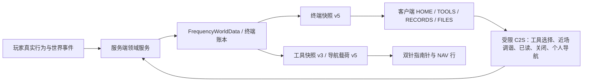

# 《第四频段》架构与安全边界

## 当前架构快照

Alpha 0.1 当前使用 Minecraft 1.21.11、Java 21、Fabric Loader 0.19.3、Fabric API 0.141.4+1.21.11、Loom 1.17.14 与 Gradle Wrapper 9.5.1。公共/服务端代码位于 `src/main`，客户端专属代码位于 `src/client`，纯 Java 测试位于 `src/test`，Minecraft 集成与客户端 GameTest 位于 `src/gametest`。

当前持久化 schema 为 v6；终端主快照协议 v5、工具快照协议 v3、独立导航协议 v5、异象生命周期协议 v3、独立末地热栏侵入协议 v1、Debug 状态协议 v2；末地终局记录版本为 v3。

## 设计原则

- 服务端权威保存世界、原版结构候选、共享碎片、终端所有权、剧情、实体、资源定位、夺取与结局。
- 客户端只渲染服务端快照，处理本地声音、界面和可关闭的可信 Meta 演出。
- 所有客户端输入都经过长度、枚举、距离、阶段、所有权或交互条件校验。
- 长期状态带版本并逐版本迁移；未来版本数据由旧代码明确拒绝。
- 世界工作使用已加载区块、空间索引、队列和固定 Tick 预算，不做无界扫描。
- 正常主线不依赖命令、日志或伪造聊天；原始读数可靠，叙事解释可以不可靠。

## 模块职责

| 模块 | 主要职责 |
|---|---|
| `bootstrap` / `registry` / `config` | 模组入口、注册表、运行时装配与配置校验 |
| `world` / `zero_station` / `facility` | 世界权威数据、零号站、原版结构碎片调查、旧设施兼容读取与规则裂缝 |
| `terminal` / `content` | 终端身份、信号日志、文件状态、资源推断、导航与物品投影 |
| `terminal/Anomaly*` | 16 项固定异象目录、单实例调度、v3 四阶段生命周期、条件预检与清理后日志 |
| `networking` | 固定 DTO、协议版本、C2S 验证和定向 S2C |
| `correction` / `entity` | 趋向群、返工体、视点分离与经历缺口两种空段及固定预算 |
| `body` / `ending` | 生存维度往返、末地祭坛、单向阶段、自定义 BOSS、稳定锚、永久战场编辑、热栏租约、伪倒计时和双结局 |
| `state` | schema v6 剧情、异象、玩家习惯和导航的强类型读取/写回边界 |
| `audio` | 叙事声音、字幕事件与峰值限制 |
| `meta_api` / `meta_windows` | 固定 Meta 事件、跨平台降级与 Windows 白名单实现 |
| `client_ui` / `client_render` | HOME/TOOLS/RECORDS/FILES 四页终端、导航硬件、模型与本地异象表现 |
| `persistence` / `narrative` | schema 迁移、不可变前人文件和数据驱动目录 |

## 权威数据流

终端物品不是权威数据库。它只携带世界 ID、终端 ID、持有人和复制代次等可验证投影；真实身份、绑定、日志、文件、剧情和结局均以世界账本为准。重复副本、旧代次或错误世界的物品会失效。

## 终端协议与四页界面

终端使用四个顶层页面：

- `HOME`：显示当前权威目标、一个首要服务端推荐与最近记录；第二槽默认等待更多数据，只在状态紧急或目标停滞后披露。点开推荐后直接进入完整详情，左上角回首页；详情内启动导航或常驻后，中间两槽才替换为一张可关闭的实时信息卡。
- `TOOLS`：住处、矿物、传送门、天气、导航和要塞始终可见。未解锁项只显示条件；工具内部只列当前已披露的目标，普通结构逐层开放，异常候选收束到淡红 `[不稳定信号源]`。
- `RECORDS`：只保留值得回看的剧情、设施、里程碑与异常事件，不按历史频段过滤。天气、维度切换、矿物扫描过程、内部标记和同组候选坐标留在对应工具；候选组在记录页只保留一条摘要。进入页面即提交“全部已读”，未读状态不再按频道分别清除。
- `FILES`：内部沿用稳定的 `FILES` wire mode 与文件 ID，玩家可见名为无方括号的“文件”。《进入祭坛前》使用“稳定锚”告知最终战斗取舍，不出现末影水晶称呼。

协议 v5 主快照保留旧站点位图、提醒频道和日志频段线号，仅用于旧客户端/旧存档解码：新快照将公开站点位图写为 `0`、提醒频道写为 `-1`，客户端聚合相关记录，不再把这些字段解释成玩家可选频道。`BAND_STAGE` 只表示无法归类的信号层已经渗入终端记录、工具和波形，不代表第四个可选择电台。

工具快照 v3 额外携带推荐工具、资源披露掩码、普通结构目标掩码、当前结构目标和不稳定来源状态。服务端按“当前任务无进展的在线 Tick”分为 0/1/2 三层：正常阶段只给主目标，约 2 分钟补充备选，约 5 分钟补充支线；任何任务 ID 或数值进展都会归零，离线不增长。滑块始终绘制并允许本地机械反馈；客户端只有在导航工具选中且服务端确认真实近场异常时才发送 `TUNE`。服务端在目标 ±2 连续 20 Tick 后再次核对范围；旧自动调频动作编号保留但明确拒绝。

资源目标坐标不混入主快照。独立导航载荷只含目标种类、是否定位、是否可导航、相对 X/Z、目标高度与玩家朝向。客户端由这些数值绘制红色北针和资源针，罗盘外圈以“前/右/后/左”匹配屏幕坐标，不能反向修改目标。

玩家通过真实要塞祭坛进入末地后，原版龙被隐藏为只负责生成出口的结算哨兵，自定义最终实体接管 Boss Bar 与战斗。`EndBossEncounterService` 权威推进观察/入侵/吞噬/坍缩，维护多人最高生命规模、稳定锚档位、普通动作/周期裂解/热栏错位三组冷却和结局；实体只负责导航、碰撞、追击与同步动画。最大生命按本轮最高同时参战人数上调且保持生命百分比；人数减少不降低规模。稳定锚存量决定既有战斗档位和裂解冷却，目标不会攻击锚。

`EndBossArenaService` 结算所有 40 Tick 预警攻击，使用持久化种子/游标、每 Tick 8 格和单场 768 格预算执行无掉落编辑；保护中央边界、出口、方块实体、关键原版/MOD 方块和公开免疫标签，且有意不读取 `mobGriefing`。`EndBossIntrusionService` 独立完成 30 Tick 预警、热栏交换、100 Tick 操作拒绝、多人轮转和清理；客户端只通过 `EndBossIntrusionS2C v1` 获取递增序号、槽位掩码和到期 Tick，复用既有眼睛表现，不存在 C2S，也不提升终端协议。

伪倒计时归零只锁定失败并保持 `body_active=true`，同时强制坍缩；归零前实际击杀才锁定成功，失败后的击杀只关闭身体而不覆写结局。两种结果都保留末地永久侵蚀。

结算后的 3×3 出口直接放在原生末地主岛祭坛，不建造额外平台。`WorldInterfaceExitPortalBlock` 实现原版 `Portal`：参战玩家首次跳入时由服务端调用 `ServerPlayer#showEndCredits`，客户端打开真实 `WinScreen`。只有收到本次结局诗包的该次 `WinScreen` 会把原版 `texts/end.txt` 替换为成功/失败及中/英文资源；普通原版结局不受影响。读完或跳过时先持久化诗篇 ACK，再执行原版 `PERFORM_RESPAWN` 回到主世界；临时末地复活点在诗开始前撤销，重生后恢复战前配置。

`DimensionViewDistanceController` 在终局完成前按客户端当前维度统一约束选项值、有效视距、设置控件和雾边界：主世界 3、下界 6、末地 12。成功诗篇的 ACK 只设置“等待返回”信号；客户端确认实际进入主世界后才将视距设为 16，并原子写入 `clientState.viewDistanceUnlocked`。该标记存在时所有 mixin 均保留原版 setter、有效距离和可用控件，雾边界使用当前真实视距；失败诗篇不会设置等待信号。

## 持久化与迁移

- 当前生产 schema：v6，迁移链为 0→1→2→3→4→5→6。
- v6 为真实木头/烈焰棒计数和新任务里程碑补齐记录；木头计数接受任意树种的原木与木板，历史校准位图、自动调频、复合冷却与旧字段仍可读。
- v3 已绑定记录迁移时从有效异象层级 1 开始，每在线 10 分钟最多追赶一个剧情层级；离线不增长。
- 未知字段在 JSON 迁移中保留；旧终端 NBT 逐字段补齐。
- 世界、终端和设施遇到高于当前版本的数据时拒绝加载，避免静默破坏。
- `StoryState`、`AnomalyState`、`PlayerPatternState` 与 `NavigationState` 直接读写既有 schema v6 根键；读取时规范化边界值，写回时不删除未知字段。
- Alpha 降级和成功终局后的视距解锁保存在客户端 `thefourthfrequency.json` 的 `clientState`；安全告示改用独立版本标记。它们都不修改 schema v6、终端协议、世界存档或服务器玩家数据。
- `EndingState v3` 只扩展末地遭遇：保存阶段、坍缩、生命比例、普通动作/裂解/错位冷却、动作轮转序号、待结算动作及游标、确定性种子和累计编辑量。活动 v2 末地战在原记录上补字段；已有永久结局和旧主世界祭坛记录不迁移、不改 ID。

## 原版结构碎片调查与旧存档

`FragmentInvestigationService` 继续保存异常碎片候选；它们只有在玩家进入过下界且达到第二层停滞提示后，才在“工具 → 导航”中以 `[不稳定信号源]` 汇总。`StructureNavigationService` 根据当前任务和停滞层级披露村庄、废弃传送门、矿井、试炼密室、下界要塞或堡垒遗迹，并只在玩家明确选择时执行一次定位与缓存，不做每 Tick 全图扫描。

旧的 `facility`、主世界祭坛与第三结局实现不删除，只作为旧存档恢复/调试路径。新末地路线只从 `active` 进入成功或失败；失败一旦由零秒锁定，之后击杀不会覆写。

## 性能边界

| 系统 | 硬上限 |
|---|---:|
| 零号站 / 旧存档设施放置 | 32 方块/Tick |
| 原版结构候选定位 | 全服每 20 Tick 至多一次定位查询；每碎片最多 3 个候选 |
| 下界裂缝放置 | 24 方块/Tick |
| 校正系统 | 默认 64 工作单元/Tick |
| 趋向群 | 索引刷新 8、实体采样 24 |
| 资源指引 | 1024 方块/玩家；全服每 Tick 最多 4 人、4096 方块 |
| 导航同步 | 终端打开时立即发送，之后每 4 Tick |
| 客户端紫黑痕迹 | 附近 16 格每次 32 个可见位置；单次客户端启动最多 512 个 |
| 末地 BOSS 永久编辑 | 中央半径 160；出口半径 8 安全；单场 768 格；每 Tick 8 格；单次攻击最多 48 格 |
| 热栏侵入 | 单一 30 Tick 预警；任意时刻一个 100 Tick 租约；仅两个热栏槽 |

所有区块查询都限制在已加载区域；实体查询使用事件维护的空间索引。状态未变化时避免无意义地标脏存档。

## 可信 Meta 安全边界

客户端初始化时读取一次本地告示版本标记，并在未确认且 `TitleScreen` 首次可用时接管标题主页面显示安全告示；它不等待单人或多人世界连接。确认后恢复被接管的同一个标题页面，并把当前版本写入 `config/thefourthfrequency-safety-notice.version`；该标记不属于世界 schema 或服务器玩家数据。确认前 ESC 和普通关闭路径不能绕过，确认后进入任何世界、服务器或再次返回标题页都不再显示。
每个 `TitleScreen` 实例都重新施加同一个会话黄色标语并禁用 Realms，因此从世界返回菜单也不会丢失二者。标题页不再根据世界阶段替换背景；世界内暂停菜单的异象表现仍由独立 Mixin 负责。

统一配置中的 `clientState.alphaDowngradeComplete` 标记存在时，构造器 Mixin 在 `Minecraft.options` 赋值后、第一次 ResourceManager 创建前仅修改本次启动的内存资源列表，不写回 `options.txt`。因此三层基底从首次加载就生效，不需要在主页出现后再启动第二次重载。启动遮罩另行预注册一张始终从 MOD JAR 内读取的 Golden Days 旧版 Logo；初始注册和资源重载都读取同一图，并固定 Alpha 的紫色背景与进度条配色，所以不会在资源应用阶段出现前半原版、后半旧版的切换。窗口标题和 Java 图标也在同一遮罩期间预热。

服务端只能发送固定异象 ID、变体、种子、时长与可选锚点，不能下发任意路径、程序名或脚本。Windows 客户端只允许：

- 操作 Minecraft 自身窗口并在退出、关闭或 F8 禁用时恢复。
- 在唯一自有临时目录中创建空白文件，用白名单 `notepad.exe` 打开；随后只有固定的自有输入助手可以逐字输入 MOD 内置文本。
- 保存 Minecraft 的标题、图标、全屏、位置和尺寸快照，演出结束后原样恢复。
- 记事本与输入助手只由玩家关闭、F8、断线或客户端退出清理；不操作任何未知窗口或无关进程。

实现使用 Java 标准文件 API 创建唯一自有临时目录、空白文件与固定 PowerShell 助手脚本；命令、脚本与文本均不来自服务端或玩家输入。助手通过 Win32 枚举本轮 Notepad 进程树，冻结首次验证过的 PID 集，并在每个 Unicode 字符前重新校验目标句柄正处于前台且属于该 PID 集；失配时立即停止。非 Windows、Meta 关闭、资源/进程启动或所有权校验失败时会降级为无提示文字的游戏内演出，不影响服务端结局。

## 依赖与许可证

运行时只依赖 Fabric Loader 与 Fabric API。构建和测试使用 Loom、Gradle Wrapper、JUnit Platform Console/Jupiter 5.10.0，以及 Minecraft 已携带的 Gson 2.13.2。新增依赖前应记录用途、固定版本、许可证与替代方案。
