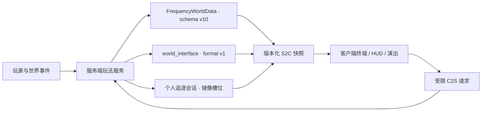

# Beta 0.4.0 架构说明

本文描述 `0.4.0-beta` 当前实现，不再把 Alpha 阶段的四阶段“异象主体”终局当成现行架构。

## 工程基线

| 项目 | 当前值 |
| --- | --- |
| Minecraft | 1.21.11 |
| Fabric Loader | 0.19.3 |
| Fabric API | 0.141.4+1.21.11 |
| Fabric Loom | 1.17.14 |
| Gradle Wrapper | 9.5.1 |
| Java | 21 |
| MOD 版本 | 0.4.0-beta |
| License | All Rights Reserved |

源码按 `main`、`client`、`test`、`gametest` 四个 source set 分层。服务端保存进度并裁决玩法，客户端只负责呈现、输入和本地结局演出；客户端请求不能直接写入权威状态。

## 权威数据与协议

| 契约 | 版本 |
| --- | ---: |
| 世界/终端 schema | v10 |
| 终端主快照 | v11 |
| 工具快照 | v6 |
| 导航 | v6 |
| 异象生命周期 | v3 |
| Debug | v5 |
| 世界接口状态格式 | v1 |
| 世界接口网络协议 | v1 |
| 诗篇开始通道 | `world_interface_poem_start_v2` |

`FrequencyWorldData` 是世界级主线、文件、发现和兼容迁移的事实源。世界接口使用独立 `world_interface` 持久化根与格式 v1；旧终局字段只用于兼容清理或历史读取，不能驱动新终局。

```mermaid
flowchart LR
    P["玩家与世界事件"] --> S["服务端玩法服务"]
    S --> W["FrequencyWorldData · schema v10"]
    S --> I["world_interface · format v1"]
    S --> R["个人追逐会话 · 镜像槽位"]
    W --> N["版本化 S2C 快照"]
    I --> N
    R --> N
    N --> C["客户端终端 / HUD / 演出"]
    C --> Q["受限 C2S 请求"]
    Q --> S
```

所有版本化载荷都必须先完成维度、玩家、持有物、会话和权限校验。旧客户端只能走明确兼容分支，未知格式应安全拒绝，而不是猜测字段含义。

## 零号站

零号站是玩家进入世界后看到的第一个人造物，由 `ZeroStationLayout`（形状）与 `ZeroStationService`（选址与建造）两个文件分工。

- **选址只做一次。** 服务器首次启动时在原始出生点 ±12 格内按 4 格网格取候选，采样每个候选站体足迹的 9 根柱子：任一采样落在液面上或读不出高度直接淘汰，其余按“高度极差 × 8 + 离原出生点的曼哈顿距离”取最小值，站心 Y 取 9 个高度的中位数。结果写入存档，之后不再重算。
- **采样前必须先取区块。** `Level.getHeight()` 不会加载任何东西——区块未加载时它不报错，而是直接返回世界底部高度。整片足迹这样读出来，一根基岩柱会被评成“完美平整的地面”，站体就被整个装配在 Y = -64 的实心岩层里。`ZeroStationService.surfaceHeight` 因此先 `getChunk` 再问高度；连同搜索范围在内最多涉及出生点周围 3×3 个区块，都是世界准备阶段已经生成过的。`M1GameTests` 用“站心上方 12 格必须是空气”守住这条回归——绝对 Y 阈值表达不了它，超平坦测试世界离世界底部只有 4 格。
- **布局是站心的纯函数。** 建造按每 Tick 64 个放置分批推进，中途关服会从持久化游标续建，因此计划必须能被逐字节重新生成：布局不读世界、不用随机源，全部风化差异来自局部坐标的哈希。`ZeroStationLayoutTest` 直接断言这一点。
- **顺序有语义。** 地板层最先写入，玩家在建造途中连入也总有落脚点；再清空整个包络（含屋顶以上两层，避免树干悬空）；然后地基、墙体、屋顶、桅杆；床与门这类双方块最后成对写入，任何 Tick 边界都不会留下半张床。
- **站体本身自带照明。** 8 处以上光源在放置时即为点亮状态，室内与屋顶都不会自然生成敌对生物。旧版唯一的铜灯以默认（未通电）状态放置，实际不发光，这条回归由单元测试守住。
- 站体不放战利品。空的终端架、空的讲台和一只空木桶属于叙事，不属于开局资源。

## 终端与主线

- 玩家页面固定为 `HOME / TOOLS / RECORDS / FILES`；wire 模式保留 `SIGNAL / FILES` 以兼容协议。
- 六个工具为住所、矿物、传送门、天气、导航、要塞。
- 矿物探针是"读取地形"而非"掷骰给结果"：服务端由近及远扫一遍已解锁矿种，取范围内最稀有的一个；每种矿的听程写在 `MineralSurveyPolicy.probeRadius`，一旦找到某矿，扫描立刻收缩到"比它更稀有者的最大听程"并很快结束。节流靠 `MINERAL_PROBE_CHARGES` 充能账本，按需在读取时前滚，不依赖常驻 tick 服务。
- 支线信号的近场接收器由“玩家已到达候选地点”直接授权调频与锁定进度，不依赖当前打开的工具详情。
- 文件解锁、异象目录和主线目标均由服务端生成快照；UI 不自行推导权威完成状态。
- 文件通知使用独立的服务端未读计数，访问 `FILES` 页即清除；它不写入破损文件的逐篇阅读状态。
- 四份破损文件的发现状态属于世界；阅读状态和完整日记权限属于终端主人。每份文件约 50% 的片段以零散、显式非乱码样式显示；发现数只控制日记标题恢复，阅读数只控制 0%—100% 解锁进度。
- 每位玩家独立读完四份破损文件后解锁完整日记；解锁不生成额外文件、方块或世界结构。
- 真实的主世界/下界往返写入同一份 `RECORDS` 事件流，并驱动完整日记在末尾自行续写。
- 导航要求服务端记录三次真实末影之眼投掷，避免客户端伪造路线。
- 当前生存目标链以“击败世界接口”收尾，不再引用旧“异象主体”。

## 异象与个人追逐边界

当前可触发目录有 19 项，分为 1—5 阶段，其中 3 项是持续数分钟的低强度“持续型”异象（`silent_world`、`temporal_drift`、`metric_drift`）。服务器决定个人阶段、滑动候选池、最近三次排除、新内容权重、冷却与成功历史；声音、着色、输入干扰等个人效果只发给目标客户端。共享型异象可以改变附近实体、门或玩家位置，但不会把目标玩家的阶段和冷却写给其他人。`disconnected_base`、`watcher_orbit`、`rework_probe`、`hostile_echo` 仅保留为历史/调试名称映射。

个人追逐使用三层服务端状态：

- `allowedForm` 由主线与活动证明给出最高许可；
- `actualForm` 由已解决追逐数确定，每次成功最多前进一级；
- `pendingChase` 只保存下一场，不积累跨门槛追逐债务。

每个形态必须先通过异象写入安全演示。生命、战斗、界面、维度、终局和镜像槽位安全检查通过后，会话从 10 秒终端预警开始：4 秒阅读窗口、4 秒只降低呈现帧率、2 秒冻结，然后由服务端切黑并开始镜像复制；预警阶段不再叠加滤镜或屏幕遮罩。正式与 Debug 测试入口共用该流程。成功推进个人形态并设置 20–30 分钟冷却；捕获或中断不推进，在 5 分钟后保留重试。

追逐进行时客户端锁住常规提示队列，只渲染“尝试逃离”。捕获进入 60 Tick 冻结结算并扣除 2 点最大生命；成功进入 60 Tick 绿色逃离结算并增加 2 点最大生命，随后统一以黑屏返程。技术性中断跳过生命惩罚。追逐校正者使用专属快速破障、支撑拆除与垂直跃迁来反制封路和搭高，并根据玩家周围的天空光与封闭程度识别矿洞、动态降低移动速度和寻路倍率。

### 镜像维度与流式快照

主世界、下界和末地各预注册两个镜像维度，但全服同时最多占用两个追逐槽位。末地槽位当前只用于拓扑和恢复对称，v1 不允许在末地开始追逐；未知模组维度也不触发。

入场事务先保存来源维度、坐标、朝向和恢复状态，再以每会话每 Tick 8192 方块预算复制 5×5 区块、垂直 ±48 格的净化快照。玩家传送后复制会话继续存活，并随当前区块请求新的 5×5 窗口。`scheduled/copied` 集合保证已复制区块不被覆盖；复制追不上极端位移时只回到最近安全位置并暂停追逐计时，不存在固定 30 格折返。

镜像世界统一从主线、导航、异象、终局和世界衰败等真实进度入口排除。玩家破坏镜像方块不获得掉落；简单放置写入持久退款账本，结算、断线和重启恢复都使用同一幂等入口。详细玩法规则见 [异象、终端形态与个人追逐](anomalies-and-pursuits.md)。

## 世界接口子系统

世界接口由五个相互约束的部分组成：

1. **祭坛事务**：冻结 1—8 名在线非旁观者名单，逐人验证绑定终端；提交前支持撤回，失败时按账本返还，全员完成后原子提交。
2. **单向状态机**：`UNPREPARED` 是未准备哨兵，正式流程覆盖场地就绪、等待、召唤、三种战斗形态、成功/失败结算、出口与完成。
3. **战斗调度**：最大生命为 `600 × 冻结人数`；八类行动共享排他控制、目标保护和恢复账本。
4. **场地策略**：使用原生末地主岛，仅生成贴地祭坛、20 座惰性门和 10 个稳定锚；永久伤痕受总量、逐 Tick 和免疫集合约束。
5. **结局桥接**：结算后开放 3×3 原生返程出口，通过原版终末之诗/重生通道返回；客户端只替换本次诗篇与其后的制作人员名单，并执行本地演出。

服务端按 Tick 先处理崩塌超时，再处理致命伤，因此临界同 Tick 结果确定为失败。全体冻结成员离线时崩塌暂停，任一成员在线即继续。

## 客户端生命周期

- 首次标题页显示 v3 安全告知，确认版本独立存放，不占用 `ModConfig`。
- Alpha 呈现按 Programmer Art → Golden Days Base → Golden Days Alpha 的顺序管理，并提供一次性旧加载界面与 “Minecraft Alpha 1.0.0” 文案。
- 结局前视距按主世界/下界/末地锁定为 6/12/16，其他维度 12；只有成功诗篇确认并实际回到主世界后永久解锁为 16。
- 两种结局都建立本地结局锁。F8 只在锁存在时打开恢复确认；无锁时不承担 Meta 开关功能。
- 恢复完成后只用 `.thefourthfrequency-corrupted` 无损标记隔离准确命中的本地存档，不修改原版世界数据。
- 已发布 LAN 的集成服务器房主在失败时保持服务器运行，缺失材质状态仅存在于房主客户端。

## 背景音乐

`MusicDirector` 通过 `MinecraftMusicMixin` 接管原版的两个接缝：`getSituationalMusic` 决定放什么，
`getMusicVolume` 决定淡入淡出的目标增益。因此调度、淡变与“正在播放”提示全部沿用原版实现。

判定按下表自上而下取第一条命中的情境。

| 情境 | 结果 |
| --- | --- |
| 追逐战镜像世界（黑屏与加载界面期间即已开始） | `music_pursuit`（1 首，循环） |
| 追逐战其余阶段（预警、捕获、逃脱结算、返程） | 静音 |
| 踏入终局传送门之后（含终末之诗与制作人员名单） | 胜利 `music_ending`／失败 `music_ending_failure`（各 1 首，循环） |
| 世界接口召唤与第一、二阶段 | `music_encounter`（1 首，循环） |
| 世界接口第三阶段 | `music_encounter_final`（1 首，循环） |
| 两种结算与传送门开启 | 静音 |
| 加载与过渡界面（`LevelLoadingScreen`／`ProgressScreen`／`GenericMessageScreen`／`ConnectScreen`／任何 Overlay） | 静音 |
| 主菜单／无玩家 | `music_menu`（4 首），但要等安全告知放行 |
| 安全告知尚未放行 | 静音 |
| 其他带音乐标记的 Boss 血条（末影龙、凋灵） | 静音 |
| 常规游戏 | `music_game`（6 首，间隔 4800 Tick／4 分钟，仍受音乐频率选项约束） |

告知放行前静音，是因为那一屏还是玩家必须读完的正文，配乐会跟它抢注意力。「放行」取的是按下「我已知晓」那一刻，而不是 `FirstRunNoticeController.acknowledge()`——后者要等屏幕跑完 28 Tick 的退场动画。等它意味着配乐比玩家的决定晚一秒半，淡入又在其后，音乐落在它本该衬托的主菜单后面。按钮按下时正文早已读完，静默不再保护任何东西。同一次入场还会把 `nextSongDelay` 清零：菜单曲自带的 20 Tick 间隔是给曲目之间用的，不该挡在这一次起音前面。击败世界接口后的余韵同样留白：
结局曲要等玩家真正踏进传送门才起。传送门那一刻服务端会下发诗篇包，`WorldInterfaceVanillaPoemClient`
把结局种类闩存下来，配乐据此在两首之间取一首——胜局在诗篇确认、世界交还玩家时释放该闩存，
败局不释放，因为那之后的整段失败演出就是这一局的剩余部分。加载界面不是一个「场景」，
而是两个场景之间的空档：让菜单曲垫在进度条底下，等于把菜单随机到的那一首带进玩家刚去的地方。

### 进入世界时的菜单曲淡出

这是唯一一次**在跟别的东西赛跑**的淡出，所以它不走原版曲线，而是 10 Tick（0.5 秒）的线性斜坡。

进入世界会把正在播的声音瞬杀两次，且两次都无法加长：`Minecraft#updateLevelInEngines` 直接
`soundManager.stop()` 停掉全部声音；Alpha 资源包切换又会让 `SoundManager#apply` 调用
`SoundEngine#reload()` 重建整个引擎。更麻烦的是留给淡出的窗口既不定长也不连续——读取存档数据时
主线程是阻塞的，那段时间一个 Tick 都不会走，真正能用的 Tick 要等到开始等待服务器就绪之后。
按秒计的淡出必然跑输，被截在半途，听感与直接消失无异；这正是原来「加陡到 1.5 秒」仍然不够的原因。

选线性而不是缓动，是因为缓动会把大部分衰减挤在头几个 Tick，剩下的拖尾很长——压到 10 Tick 时
听起来像被削掉一截而不是淡出。等长的直线斜坡虽短，但明确是一次淡出。斜坡每 Tick 由记下的起点
重新算出（而不是逐 Tick 累乘），所以原版在同一 Tick 里对同一个值做的缓动无法把它带偏。
走完斜坡会主动 `stopPlaying()`：此时已经听不见，但要把音轨真正交还，否则一首零增益的曲子会一直
占着通道直到世界切换把它抹掉。

加载结束的边沿仍保留一次 `stopPlaying()` 兜底，应付短到连 0.5 秒斜坡都装不下的加载。
追逐战豁免这两条，因为黑屏底下盖着的正是镜像维度的切换，而追逐曲此时正在淡入。

### 追逐曲为什么等镜像世界

`music_pursuit` 的判据不是「黑屏开始了」，而是「客户端已经拿到镜像世界」。原因在原版：
`ClientPacketListener#handleRespawn` 里有一句无条件的 `getMusicManager().stopPlaying()`，
每一次维度切换都会执行。在传送**之前**起播的曲子会被它从淡入中途掐掉，而 `music_pursuit` 的
`minDelay` 为 0，管理器紧接着又从第一小节重放一遍——听感就是曲子刚起来就卡回开头。
放到传送**之后**起播不损失任何东西：黑屏同时盖住了传送和加载界面，淡入仍然发生在黑屏底下。

### 起音不能有爆音

音量增益只在 `MusicManager` 自己的淡变里被推进音频引擎（`updateCategoryVolume`），而淡变只在
已经有曲子在播时才运行。于是「上一首被硬停 → 下一首起播」这条路径上，引擎里留着的仍是上一首的
分类音量：新曲的第一个 Tick 会以那个音量整整响 50 毫秒，下一个 Tick 才被拽回淡入起点——这就是
一声爆音，且正好落在本该是淡入的位置。所以 `silenceGain` 把增益和分类音量**一起**归零，
入场才真的从静默开始。
### 常规游戏曲的间隔

`music_game` 用 `Music(holder, 4800, 7200, false)`，而不是原版的 `Musics.createGameMusic`
（10–20 分钟）。**真正决定间隔的只有下界**：管理器每 Tick 都重新在这个区间取一次随机数并与当前值取
最小，包括曲子播放期间的那几千 Tick，所以取到的值早被压到区间底部，上界基本只是意图声明。

原版那套节奏是给「一整个游戏共用一个播放列表」设计的。六首平均两分钟出头的曲子按 10 分钟间隔播，
配乐可闻时间不到两成，跑完一轮要一个多小时——玩家可能打完一整段主线都听不到其中一半。改成 4 分钟后
可闻占比约三分之一，一轮在一次正常游玩时长内跑完。再往下压就会开始与本作相悖：这里静默才是常态，
而配乐一响就等于告诉玩家这一刻是被编排过的、因而是安全的。空档不至于听起来像断线，是因为底下还有
信号床在垫着。

玩家的音乐频率选项仍然有效：「频繁」的上限是 12000 Tick，高于 4800，因此不产生影响；
「持续」在管理器里被硬编码为 100 Tick，会覆盖任何曲目自带的节奏。

### 战斗曲交接

其余每一次换曲中间都隔着一段刻意的静默，原版的淡变曲线正好覆盖：目标增益降到 0，旧曲约 15 秒淡出，
新曲约 10 秒淡入。BOSS 战是唯一的例外——常规游戏曲直接让位给召唤，前两阶段又直接让位给第三阶段，
按原版速度这两次交接要么是硬切，要么是战斗中间 25 秒的空洞。

所以 `MusicDirector` 用同样的两条曲线、但陡得多地自己接管这两次交接：

1. **淡出**：`situationalMusic` 在交接期间返回 null（于是目标增益为 0），同时每 Tick 在原版
   0.97 的衰减之上再乘 0.80，约 1.5 秒清空声道，原版随即自行 `stopPlaying()`。
2. **起播**：把 `nextSongDelay` 清零。每次停止都会给它加 100 Tick，而「持续」音乐频率选项还会把
   间隔锁死在 100 Tick——两者都会凭空多出 5 秒空白。
3. **淡入**：每 Tick 额外跑 7 次原版的淡入步进，约 1.2 秒回到目标增益。

整段交接略少于 3 秒，正好装得进变身动作里。因此 `music_encounter` 与 `music_encounter_final`
的 `replaceCurrentMusic` 必须为**假**：该标志在音乐管理器自己的 tick 里判定，早于本类看到这一帧，
留着它就会在交接开始前先把旧曲切掉。其余曲目仍是 0 延迟 + 即时顶替。

静音走的是增益淡出而非直接停止，所以离开一个情境时音乐是退场而不是被掐断。
原版的增益只在有曲子播放时才会缓动，起始值是 1，因此 `MusicManagerGainAccessor` 在「没有曲子在播、
但马上要有」的边沿把增益压到 0，让每一次起音都是淡入。该写入以 `currentMusic == null` 为前提，
避免情境抖动一帧就掐断正在淡出的曲子。硬切点只有两处——追逐黑屏与被捕获，那里的设定是信号被切断；
黑屏那一次硬切正是为了让追逐曲从真正的静默里淡进来。

音频素材以 44.1 kHz 立体声 Ogg Vorbis（q4）随模组分发，母带增益在 `tools/import_music.py`
导入时按 40% 烘焙进文件，而不是写在 `sounds.json` 里。该比例始终相对无损母带，重新导入不会叠加。

## 配置面

`ModConfig` 只保留实际生产读取的五项：

| 路径 | 默认值 | 用途 |
| --- | ---: | --- |
| `meta.enabled` | `true` | Meta 演出总开关 |
| `meta.peakVolume` | `0.8` | Meta 音量峰值 |
| `pacing.developerAcceleration` | `false` | 开发节奏加速 |
| `clientState.alphaDowngradeComplete` | `false` | Alpha 降级一次性状态 |
| `clientState.viewDistanceUnlocked` | `false` | 成功结局视距解锁 |

## 预算与保护

| 子系统 | 当前预算/限制 |
| --- | --- |
| 世界接口永久伤痕 | 总计 8192 格；每 Tick 32 格 |
| 激光场地编辑 | 90 Tick 锁定 + 40 Tick 扫射；扫射期每 2 Tick 一次半径 2、上限 6 格的落点擦伤 |
| 龙息弹落点 | 半径 3 + 形态、上限 14 + 形态×10 格；飞行上限 120 Tick、速度 0.95 格/Tick；龙息效果云 220 Tick |
| 天降光束落点 | 主坑半径 7、上限 90 格；外圈腐蚀半径 9、上限 34 格 |
| 触手抽击 | 45 Tick 扬起后每 45 Tick 一次、共 3 次；每次半径 3、上限 12 格 |
| 崩塌计时 | 7200 Tick；全员离线暂停 |
| 行动间隔 | 一阶段 140–180 Tick；二阶段 100–140；三阶段 35–60，另加每 45 Tick 一次、最多同时 3 个的齐发 |
| 强控制保护 | 同目标 600 Tick；强控制互斥（齐发通道不参与，它只投放非强控行动） |
| 资源扫描 | 每人 1024；最多 4 人合计 4096 |
| 导航工作 | 每 Tick 4 个单元 |
| 私人追逐并发 | 全服最多 2 场 |
| 追逐初始快照 | 5×5 区块；垂直 ±48 格 |
| 追逐流式复制 | 每会话每 Tick 8192 方块；水平无固定边界 |

场地保护覆盖基岩、黑曜石柱、末地返回结构、方块实体、关键 MOD 方块、`#thefourthfrequency:world_interface_immune` 及兼容免疫标签。安全模式 `-Dthefourthfrequency.safeMode=true` 仅用于恢复中断事务，不是跳过正常玩法的发布选项。
