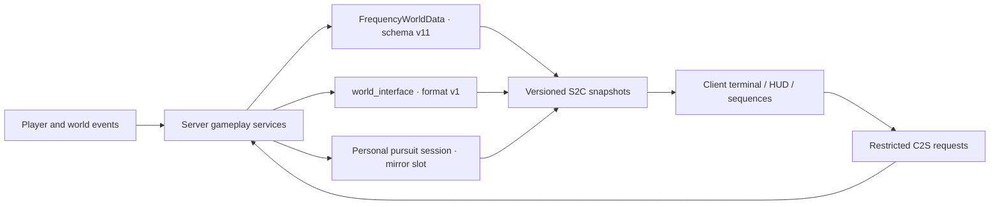

# Architecture and safety boundaries

The authoritative data flow, persistence, protocol and budgets of `1.0.0-rc.1`. Music has its own document: [Background music](audio.md).

The old four-phase "anomaly body" finale, the old Overworld altar and their compatibility fields exist only for historical reads and safe cleanup. **They no longer drive any gameplay.**

## Engineering baseline

| Item | Current value |
| --- | --- |
| Minecraft | 1.21.11 |
| Fabric Loader | 0.19.3 |
| Fabric API | 0.141.4+1.21.11 |
| Fabric Loom | 1.17.14 |
| Gradle Wrapper | 9.5.1 |
| Java | 21 |
| Mod version | 1.0.0-rc.1 |
| Licence | All Rights Reserved |

The source is split across four source sets: `main`, `client`, `test`, `gametest`. The server stores progress and adjudicates gameplay; the client only presents, takes input and runs local ending sequences. Client requests can never write authoritative state directly.

## Authoritative data and protocol

| Contract | Version |
| --- | ---: |
| World/terminal schema | v11 |
| Terminal main snapshot | v13 |
| Tool snapshot | v6 |
| Navigation | v6 |
| Anomaly lifecycle | v3 |
| Debug | v5 |
| World Interface state format | v1 |
| World Interface network protocol | v2 |
| Poem start channel | `world_interface_poem_start_v3` |

Terminal snapshot v13 appended `attentionActive` (is the terminal asking for attention right now?) to v12. v12 appended `onboardingRequired` (does this new player still owe a boot sequence?) to v11. Both were appends rather than insertions, because decoding is positional: a boolean inserted in the middle silently misaligns every varint after it.

`attentionActive` is **a boolean that has already been adjudicated**, not four conditions for the client to assemble. It comes from `TerminalData.attentionActive(record)` — the same call that decides which of the item's six forms the player is holding — so the amber lamp in the panel's hardware column and the amber lamp on the device in their hand cannot disagree. Three of the four sources (unread signal, unread file, claimable reward) are already on the wire; the fourth (navigation completed but unacknowledged) is not. A UI that "approximates it from the fields it happens to have" will eventually contradict the item itself.

The matching persistence key is `onboarding_done` in each player's terminal record — a one-way latch set by the server the moment all four tabs have been visited, never cleared afterwards. It is stored separately from `terminal_page_visit_mask`, which is task progress and can be reset or change with the page count; this bit records that *this happened once to this player*.

**Adding a terminal-record key does not require raising `PersistenceSchema.CURRENT_VERSION`.** Backfill is driven by key presence in `TerminalData.migrateRecord` (`if (!record.contains(key))`), which is how every new key has ever been added; a schema step for one would only add an identity migration. Schema steps are reserved for changes that actually alter the meaning or structure of existing fields.

`FrequencyWorldData` is the source of truth for the world-level mainline, files, discoveries and compatibility migration. The World Interface uses its own `world_interface` persistence root at format v1; retired finale fields are for compatibility cleanup and historical reads only and cannot drive the current finale.

Every versioned payload must first pass dimension, player, held-item, session and permission checks. Old clients may only take an explicit compatibility branch; an unknown format is rejected safely rather than guessed at.

**`world_interface_blast_v1` is a pure presentation channel.** It carries one explosion's coordinates, radius and tier (`LIGHT/MEDIUM/HEAVY/CATACLYSM`). It is not persisted, not acknowledged, and losing a packet costs one camera shake — so it has no version step, because it describes no authoritative state.

Its boundary is worth writing down, because it looks like a duplicate of what `BossActionS2C` can already do. The rule is: **beats are derived, blasts are notified.** From the action envelope (id, start tick, duration, target) the client can work out which tick a given beat lands on, and those events stay derived. But the third phase's **volley channel** deliberately writes no envelope, the breath bolt is an entity that hits arbitrary things on arbitrary ticks, the laser's impact point crosses the whole island in two seconds, and a stability anchor falls when the player decides to hit it. None of that is a function of the envelope. Only the server knows where the blast is; only the client knows where its camera is. So the radius comes from the server and the falloff is computed on the client, and one packet serves eight players standing in eight places.

**Per-source throttling** on that same channel (`WorldInterfaceBlastService`, 6 ticks by default) doubles as protection for the client mixer: each of those blast points also plays a sound, and one unthrottled laser sweep stacks dozens of overlapping samples and shake impulses. The two reproductions of long-phase silence peaked at only `15/247` and `16/247` channels, so channel exhaustion was ruled out. The server-side scheduler deadlock on a targetless exclusive action and the client-side `HOSTILE` engine gain/pause stall are handled separately; throttling only carries the mixing and presentation budget.

## Station Zero

Station Zero is the first artefact the player sees. Two files split the job: `ZeroStationLayout` (shape) and `ZeroStationService` (siting and construction).

- **Siting happens once.** On first server start, candidates are taken on a 4-block grid within ±12 blocks of the original spawn point, sampling nine columns of each candidate footprint. Any sample on a liquid surface, or whose height cannot be read, disqualifies the candidate; the rest are scored by `height range × 8 + Manhattan distance from the original spawn` and the minimum wins, with the station's centre Y taken as the median of the nine heights. The result is persisted and never recomputed.
- **Chunks must be fetched before sampling.** `Level.getHeight()` loads nothing — for an unloaded chunk it does not error, it simply returns the world's bottom height. Read that way, a whole footprint of bedrock scores as "perfectly flat ground" and the station gets assembled inside solid rock at Y = -64. `ZeroStationService.surfaceHeight` therefore calls `getChunk` before asking for the height; including the search range that touches at most a 3×3 chunk area around spawn, all of which world preparation has already generated. `M1GameTests` guards the regression with "12 blocks above the station centre must be air" — an absolute Y threshold cannot express it, because a superflat test world is only 4 blocks above the world bottom.
- **The layout is a pure function of the centre.** Construction advances in batches of 64 placements per tick and resumes from a persisted cursor after a restart, so the plan must be byte-for-byte reproducible: the layout reads no world state and uses no random source, and all weathering variation comes from a hash of local coordinates. `ZeroStationLayoutTest` asserts this directly.
- **Order carries meaning.** The floor layer is written first, so a player joining mid-build always has somewhere to stand; then the whole envelope is cleared (including two layers above the roof, to avoid floating tree trunks); then foundation, walls, roof and mast. Double blocks like the bed and the door are written last, in pairs, so no tick boundary ever leaves half a bed.
- **The station lights itself.** Eight or more light sources are placed already lit, and neither the interior nor the roof spawns hostiles naturally. The one legacy copper lamp was placed in its default (unpowered) state and emitted nothing; a unit test guards that regression.
- **No loot.** The empty terminal rack, the empty lectern and the empty barrel are narrative, not starting resources.

## Terminal and mainline

- Player pages are fixed as `HOME / TOOLS / RECORDS / FILES`; the wire keeps `SIGNAL / FILES` for protocol compatibility.
- The detailed contract for appearance, animation timing, first-run onboarding and the handheld model is in [Terminal interface and handheld form](terminal-ui.md). Page changes, presses and scrolling only affect drawing: page fields switch at the instant of the click, and hit testing never lags the animation.
- The six tools are shelter, mineral, portal, weather, navigation and stronghold.
- The weather tool's sky instrument samples the sky the client is actually rendering and maintains four channels — zenith, horizon, star magnitude and celestial phase. Only `red_horizon` and `temporal_drift` drive that page's progressive fault sequence; other pages and the exit controls are unaffected.
- The mineral probe *reads terrain* rather than *rolling for a result*: the server scans unlocked ore types from near to far and takes the rarest one in range. Each ore's reach is in `MineralSurveyPolicy.probeRadius`; once one is found, the scan immediately shrinks to "the largest reach of anything rarer" and ends soon after. Throttling uses the `MINERAL_PROBE_CHARGES` ledger, rolled forward on read rather than by a resident tick service.
- The near-field receiver for side signals is authorised to tune and accumulate lock progress by "the player has reached the candidate site" alone, independent of which tool detail is open. Correct tuning must be held for 20 ticks, and the tool snapshot syncs progress every 2 ticks during the lock.
- File unlocks, the anomaly catalogue and mainline objectives are all snapshotted by the server; the UI never derives authoritative completion itself.
- File notifications use a separate server-side unread count cleared by visiting `FILES`. It does not write the per-file read state of the damaged files.
- `FILES`, `RECORDS`, tool details and navigation candidates each maintain their own scroll/overflow state. The `RECORDS` unread count only counts record entries visible in the snapshot, and a pursuit force-opening the records page does not overwrite the page the player was on.
- Discovery state for the four damaged files belongs to the world; read state and full-journal access belong to the terminal's owner. Roughly 50% of each file is shown as scattered, explicitly non-garbled fragments; the discovery count only controls recovery of the journal title, and the read count only controls the 0%–100% unlock progress.
- Each player unlocks the complete journal after reading all four damaged files themselves. Unlocking generates no extra file, block or world structure.
- After fragments are first assigned, one idempotent rescue pass runs over any file still empty, so legacy or edge-case data cannot leave a permanently blank file.
- Real Overworld/Nether round trips write into the same `RECORDS` event stream and drive the complete journal to continue itself at the end.
- Navigation requires the server to have recorded three real eye-of-ender throws, so a client cannot forge a route.
- The survival objective chain ends with "defeat the World Interface"; it no longer references the old "anomaly body".

## Anomaly and pursuit boundaries

The triggerable catalogue holds 19 entries across tiers 1–5, of which 3 are low-intensity *sustained* anomalies lasting minutes (`silent_world`, `temporal_drift`, `metric_drift`). The server decides the personal tier, the sliding candidate pool, the exclusion of the last three, new-content weighting, cooldowns and success history; personal effects such as sound, tinting and input interference are sent only to the target client. Every anomaly opens with the vanilla `ambient.cave` played positionally: at the anchor when there is one, otherwise at a bearing 9 blocks from the player derived from a stable seed. Shared anomalies may alter nearby entities, doors or player positions, but never write the target's tier or cooldowns onto anyone else. `disconnected_base`, `watcher_orbit`, `rework_probe` and `hostile_echo` survive only as historical/debug name mappings.

Personal pursuits use three layers of server state:

- `allowedForm` — the ceiling granted by the mainline and activity proof;
- `actualForm` — determined by resolved pursuits, advancing at most one level per success;
- `pendingChase` — holds only the next one; it never accumulates a debt of pursuits across thresholds.

Every form must first be written as a safe demonstration by an anomaly. Once the health, combat, interface, dimension, finale and mirror-slot safety checks pass, the session begins with a 10-second terminal warning: 4 seconds to read, 4 seconds of presentation frame-rate decay only, 2 seconds frozen, then the server cuts to black and begins mirror copying. No filter or screen overlay is layered on during the warning. The real and debug entry points share this flow. Success advances the personal form and sets a 20–30 minute cooldown; capture or interruption does not advance it and keeps a retry available after 5 minutes.

While a pursuit runs, the client locks the ordinary notification queue and renders only "attempt to escape". Capture enters a 60-tick frozen resolution and removes 2 points of maximum health; escape enters a 60-tick green resolution and adds 2 points; both return through a black screen. A technical interruption skips the health penalty. The pursuing Corrector uses dedicated fast breaching, support demolition and vertical leaps to counter walling-in and pillaring, and it recognises cave environments from sky light and enclosure around the player, dynamically lowering its movement speed and pathfinding multiplier.

### Mirror dimensions and streaming snapshots

The Overworld, Nether and End each pre-register two mirror dimensions, but at most two pursuit slots are occupied server-wide at once. The End slots currently exist only for topological and recovery symmetry; v1 does not allow a pursuit to start in the End, and unknown modded dimensions do not trigger one either.

The entry transaction first saves the source dimension, coordinates, facing and recovery state, then copies a sanitised snapshot of 5×5 chunks and ±48 blocks vertically at a budget of 8192 blocks per session per tick. The black screen waits for 7×7 chunks around the player in the destination dimension to be ready and stable for 8 consecutive ticks, up to 200 ticks. The copy session survives player teleports and requests a new 5×5 window around the current chunk. The `scheduled`/`copied` sets guarantee copied chunks are never overwritten; when copying cannot keep up with extreme displacement, the player is held at the nearest safe position and the pursuit timer pauses — there is no fixed 30-block turnback.

Mirror worlds are excluded uniformly from every real-progress entry point: mainline, navigation, anomalies, the finale and world decay. Breaking mirror blocks yields no drops; simple placements are written into a persistent refund ledger, and resolution, disconnect and restart recovery all use the same idempotent entry point. Cross-dimension return restores player visibility before teleporting; if death or an admin teleport already moved the player out of the mirror, the session only clears the slot, refunds and visibility state and does not drag them back to the entry point. Full gameplay rules are in [Anomalies, terminal forms and personal pursuits](anomalies-and-pursuits.md).

## The World Interface subsystem

Six mutually constraining parts:

1. **Altar transaction** — freezes a roster of 1–8 online non-spectators and validates each bound terminal. Withdrawal is supported before submission, failures refund by ledger, and the commit is atomic once everyone is done.
2. **One-way state machine** — `UNPREPARED` is the not-yet-prepared sentinel; the real flow covers arena ready, waiting, summoning, three combat forms, success/failure resolution, exit and complete.
3. **Combat scheduling** — maximum health is `600 × (1 + 0.5 × (roster - 1))`. The five genuine targeting locks and the two unavoidable deprivations (weapon impound, hotbar sweep) use different telegraphs, and only impounded weapons enter the recovery ledger.
4. **Arena policy** — the native End main island is used; only a ground-hugging altar, twenty inert gateways and ten stability anchors are generated. Surviving anchors project a radius-8 stability zone from their authoritative position, constraining player damage reduction, server terrain edits and client erosion presentation in one place. Permanent scarring is still bounded by total, per-tick and immunity-set limits.
5. **Stability anchor entities** — ten slots carried by `StabilityAnchorEntity` with stable indices and deterministic UUIDs; the truth about survival still lives only in `WorldInterfaceState` (the disk key is still `crystal_uuid`; the Java-side meaning is `anchorEntityUuid`). `EndBossArenaService` migrates legacy saves on both the preparation and restart-recovery paths: an `EndCrystal` carrying this mod's anchor tag is safely removed and re-created as the dedicated entity with the same UUID and index, while untagged vanilla end crystals are only cleaned by the pre-existing de-duplication logic. The entity syncs only the anchor index and the destruction clock; `StabilityAnchorGeometry` is the shared source of geometry and timing constants for the model, the beam endpoint and the destruction effect.
6. **Ending bridge** — resolution opens a 3×3 native return exit and goes home through the vanilla End poem/respawn channel. The success payload carries the final broken-anchor count so the client can pick the all-preserved, partial or all-broken poem, replacing only this run's poem, credits and post-credits text and running local sequences.

The server processes collapse timeout before lethal damage each tick, so a same-tick borderline result is deterministically a failure. Collapse pauses when every frozen member is offline and resumes as soon as one is online.

**The rig is shared, and hitboxes are bound to it.** `WorldInterfaceClip`/`WorldInterfaceClips` (common) hold the single copy of thirty-seven keyframe clips, and `WorldInterfaceRig` (common) poses the whole skeleton from them plus procedural layers (hover drift, neck growth, head tracking, limb follow, structural sag). The server poses once per tick and caches it in `WorldInterfaceEntity.rigPose()`, which all twenty `WorldInterfacePartEntity` hit proxies read; the client's `WorldInterfaceModel.setupAnim` poses with the same function and writes into `ModelPart`, so the vanilla `KeyframeAnimation` system no longer runs at all. Every input driving the pose is available on both sides: form, entity `tickCount`, the synced `HEALTH_FRACTION` field, and the already-synced action id and start tick. There is no second formula between hitbox and drawing, and therefore nothing that can drift.

Once the state machine enters success or failure resolution, ordinary anomalies, gap pressure, decay and pursuits close permanently and do not reopen after `COMPLETE`.

## Client lifecycle

- The first title screen shows the v3 safety notice. The acknowledged version is stored separately and does not occupy `ModConfig`.
- Alpha presentation is managed as Programmer Art → Golden Days Base → Golden Days Alpha, with a one-off legacy loading screen and "Minecraft 1.0.0" strings. After the corruption completes, the window title and version stamp are that same string, identical in singleplayer and multiplayer and with no world suffix.
- The Alpha presentation's "damaged medium" layer is **real post-processing**: `ScreenFilterDriver` runs `analog_signal.fsh` (still variant) over the whole frame before `blitToScreen`, so scan lines, grain, radial chromatic aberration, highlight bloom and vignette act on the entire picture **including the failure text itself**, rather than being painted on top of it. The wall of text fills in a single frame with no reveal animation; the mistracking band and the recording timecode are still drawn — the former as one slow sweep on the screen clock, the latter as overlay content. A failure relaunch keeps this presentation until F8 recovery completes.
- Glitch across the whole mod is split into two languages that are never mixed: **analog signal** (the medium is breaking — anomaly impacts, both loading screens, the terminal weather card) and **digital corruption** (the rules are breaking — private pursuits, World Interface lock/expulsion). Details and "why a real filter is possible now" are in [Anomalies, terminal forms and personal pursuits](anomalies-and-pursuits.md).
- There are two post-processing slots. The level slot is arbitrated by `PostEffectArbiter` as `PURSUIT > WORLD_INTERFACE` and affects only the world image (HUD and terminal prompts must stay readable). The full-frame slot is driven by `ScreenFilterDriver` over world + HUD + current screen, and claims take effect per frame. Chains this mod did not install are neither overwritten nor cleared.
- Band-style GUI overlays (pursuit interference bands, impact tear/mistracking bands, loading-screen tracking bands) are all disabled and carried by shader terms instead. The four methods remain in source as reference and fallback; the contract test only asserts that nothing calls them.
- The terminal weather card is the last thing still drawn with `AnalogFilter`: it is a rectangle inside a page, and a full-frame chain's uniforms are baked at load and cannot express "only this rectangle". Its grain is a generated layer texture (`tools/generate_analog_filter_textures.py`, one white and one black pass giving zero-mean noise).
- Before the ending, view distance is locked per dimension to 6/12/16 for Overworld/Nether/End and 12 elsewhere. It unlocks permanently to 16 only after the success poem is confirmed *and* the player is really back in the Overworld.
- Both endings establish a local ending lock. F8 opens the recovery confirmation only when a lock exists; without one it carries no meta-switch function.
- After recovery, only the exactly-matching local save is isolated with the lossless `.thefourthfrequency-corrupted` marker; vanilla world data is not modified. The marker makes a successful save read *sealed* and a failed one read *corrupted*, and neither can be entered.
- Every failing player sees blocks, entities and fluids as missing textures on their own client. A published-LAN integrated-server host keeps their server running, and LAN guests and the server world are unaffected. Both endings hand quitting back to the pause menu.

## Configuration surface

`ModConfig` keeps only the five entries production actually reads:

| Path | Default | Purpose |
| --- | ---: | --- |
| `meta.enabled` | `true` | Master switch for meta sequences |
| `meta.peakVolume` | `0.8` | Peak volume for meta audio |
| `pacing.developerAcceleration` | `false` | Development pacing acceleration |
| `clientState.alphaDowngradeComplete` | `false` | One-off Alpha downgrade state |
| `clientState.viewDistanceUnlocked` | `false` | View-distance unlock after a successful ending |

## Budgets and protection

| Subsystem | Current budget / limit |
| --- | --- |
| World Interface permanent scarring | 8192 blocks total; 32 blocks per tick |
| Laser arena editing | 90-tick lock + 40-tick sweep; during the sweep, a radius-2 scorch capped at 6 blocks every 2 ticks |
| Breath-bolt impact | Radius 3 + form, capped at 14 + form × 10 blocks; flight capped at 120 ticks at 0.95 blocks/tick; dragon-breath cloud 220 ticks |
| Sky-lance impact | Main crater radius 7, capped at 90 blocks; outer corrosion radius 9, capped at 34 blocks |
| Tendril lash | 45-tick raise, then once every 45 ticks, three times; radius 3 capped at 12 blocks each |
| Collapse timer | 12000 ticks; paused when everyone is offline |
| Action interval | Phase 1 150–200 ticks; phase 2 75–105; phase 3 35–60. Multiplied by the roster density factor `1 / (1 + 0.18 × (roster - 1))` (floor 0.45) and never below 20 ticks |
| Phase-3 volley | Every 40 ticks; concurrency cap `3 + (roster - 1) / 2` |
| Exclusive-control protection | 600 ticks per target; exclusive controls are mutually exclusive (the volley channel is exempt — it only dispatches non-exclusive actions) |
| Resource scanning | 1024 per player; at most 4 players, 4096 total |
| Navigation work | 4 units per tick |
| Private pursuit concurrency | At most 2 server-wide |
| Pursuit initial snapshot | 5×5 chunks; ±48 blocks vertically |
| Pursuit streaming copy | 8192 blocks per session per tick; no fixed horizontal boundary |

Arena protection covers bedrock, the obsidian pillars, the End return structures, block entities, key mod blocks, `#thefourthfrequency:world_interface_immune` and the compatibility immunity tag. Safe mode `-Dthefourthfrequency.safeMode=true` exists only to recover an interrupted transaction; it is not a shipping option for skipping normal gameplay.
