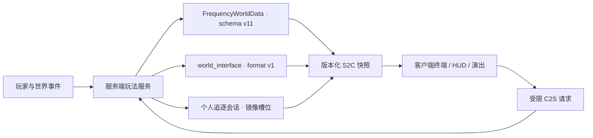

# 架构与安全边界

本文描述 `1.0.0-rc.1` 的权威数据流、持久化、协议与预算。配乐单独见[背景音乐](audio.md)。

旧的四阶段“异象主体”终局、主世界旧祭坛与相关兼容字段只用于历史读取或安全清理，**不再驱动任何玩法**。

## 工程基线

| 项目 | 当前值 |
| --- | --- |
| Minecraft | 1.21.11 |
| Fabric Loader | 0.19.3 |
| Fabric API | 0.141.4+1.21.11 |
| Fabric Loom | 1.17.14 |
| Gradle Wrapper | 9.5.1 |
| Java | 21 |
| MOD 版本 | 1.0.0-rc.1 |
| License | All Rights Reserved |

源码按 `main`、`client`、`test`、`gametest` 四个 source set 分层。服务端保存进度并裁决玩法，客户端只负责呈现、输入和本地结局演出；客户端请求不能直接写入权威状态。

## 权威数据与协议

| 契约 | 版本 |
| --- | ---: |
| 世界/终端 schema | v11 |
| 终端主快照 | v13 |
| 工具快照 | v6 |
| 导航 | v6 |
| 异象生命周期 | v3 |
| Debug | v5 |
| 世界接口状态格式 | v1 |
| 世界接口网络协议 | v2 |
| 诗篇开始通道 | `world_interface_poem_start_v3` |

终端主快照 v13 相对 v12 在末尾追加了 `attentionActive`（终端此刻是否在要玩家注意）。v12 相对 v11 追加的是 `onboardingRequired`（新玩家是否还欠一次开机引导）。两次都是追加而非插入，因为解码按位置进行，中间插一个布尔会让其后每个 varint 静默错位。

`attentionActive` 是**已经裁决完的一个布尔**，不是让客户端自己拼的四个条件。它由 `TerminalData.attentionActive(record)` 给出，而那正是决定玩家手上物品显示六形态中哪一个的同一次调用——所以面板硬件列上的琥珀灯和手里那台机器上的琥珀灯不可能各说各话。四个来源里有三个（未读信号、未读文件、可领取奖励）本来就在线上，第四个（导航完成未确认）不在；一个"用手头有的字段近似一下"的 UI 迟早会和物品本身对不上。

对应的持久化键是每玩家终端记录里的 `onboarding_done`，一个单向闩锁：四个标签页全部访问过的那一刻由服务端置位，此后不再复位。它与 `terminal_page_visit_mask` 分开保存——那是任务进度，可以被重置、也会随页面数量改变；这一位记录的是“这件事在这个玩家身上发生过一次”。

**新增一个终端记录键不需要抬 `PersistenceSchema.CURRENT_VERSION`。** 回填由 `TerminalData.migrateRecord` 按键存在性驱动（`if (!record.contains(key))`），历史上每个新键都是这样补的；为它加一级 schema 只会多一个恒等迁移。schema 台阶留给真正改变已有字段含义或结构的改动。

`FrequencyWorldData` 是世界级主线、文件、发现和兼容迁移的事实源。世界接口使用独立 `world_interface` 持久化根与格式 v1；旧终局字段只用于兼容清理或历史读取，不能驱动新终局。

所有版本化载荷都必须先完成维度、玩家、持有物、会话和权限校验。旧客户端只能走明确兼容分支，未知格式应安全拒绝，而不是猜测字段含义。

**`world_interface_blast_v1` 是纯呈现通道。** 它只带一次爆炸的坐标、半径与档位（`LIGHT/MEDIUM/HEAVY/CATACLYSM`），不持久化、不确认、丢一个包的代价就是少一次相机抖动，因此没有版本号台阶——它不描述任何权威状态。

它存在的边界值得写下来，因为它看起来像是在重复 `BossActionS2C` 已经能做的事：**节拍靠推导，爆炸靠通知**。客户端从行动信封（编号、起始 Tick、时长、目标）能自己算出某个节拍落在哪一 Tick，那类事件继续推导。但第三阶段的**齐发通道**按设计不写入信封，龙息弹是一个在任意 Tick 撞到任意东西的实体，激光的落点在两秒里横穿全岛，而稳定锚在玩家决定动手时才倒——这些都不是信封的函数。"爆炸在哪"只有服务端知道，"摄像机在哪"只有客户端知道，所以半径由服务端给、衰减由客户端算，一个包服务八个站在不同位置的玩家。

同一条通道上的**每源节流**（`WorldInterfaceBlastService`，默认 6 Tick）同时是客户端混音器的保护：这些爆炸点每一个都同时发声，不限速的激光扫射一次就会堆出数十个重叠采样和抖动脉冲。长阶段静音的两次复现峰值仅 `15/247` 和 `16/247`，已排除通道耗尽。服务端的无目标强控排程卡死与客户端的 `HOSTILE` 引擎增益/暂停滞留分别处理；节流只承担混音与呈现预算。

## 零号站

零号站是玩家进入世界后看到的第一个人造物，由 `ZeroStationLayout`（形状）与 `ZeroStationService`（选址与建造）两个文件分工。

- **选址只做一次。** 服务器首次启动时在原始出生点 ±12 格内按 4 格网格取候选，采样每个候选站体足迹的 9 根柱子：任一采样落在液面上或读不出高度直接淘汰，其余按“高度极差 × 8 + 离原出生点的曼哈顿距离”取最小值，站心 Y 取 9 个高度的中位数。结果写入存档，之后不再重算。
- **采样前必须先取区块。** `Level.getHeight()` 不会加载任何东西——区块未加载时它不报错，而是直接返回世界底部高度。整片足迹这样读出来，一根基岩柱会被评成“完美平整的地面”，站体就被整个装配在 Y = -64 的实心岩层里。`ZeroStationService.surfaceHeight` 因此先 `getChunk` 再问高度；连同搜索范围在内最多涉及出生点周围 3×3 个区块，都是世界准备阶段已经生成过的。`M1GameTests` 用“站心上方 12 格必须是空气”守住这条回归——绝对 Y 阈值表达不了它，超平坦测试世界离世界底部只有 4 格。
- **布局是站心的纯函数。** 建造按每 Tick 64 个放置分批推进，中途关服会从持久化游标续建，因此计划必须能被逐字节重新生成：布局不读世界、不用随机源，全部风化差异来自局部坐标的哈希。`ZeroStationLayoutTest` 直接断言这一点。
- **顺序有语义。** 地板层最先写入，玩家在建造途中连入也总有落脚点；再清空整个包络（含屋顶以上两层，避免树干悬空）；然后地基、墙体、屋顶、桅杆；床与门这类双方块最后成对写入，任何 Tick 边界都不会留下半张床。
- **站体本身自带照明。** 8 处以上光源在放置时即为点亮状态，室内与屋顶都不会自然生成敌对生物。旧版唯一的铜灯以默认（未通电）状态放置，实际不发光，这条回归由单元测试守住。
- 站体不放战利品。空的终端架、空的讲台和一只空木桶属于叙事，不属于开局资源。

## 终端与主线

- 玩家页面固定为 `HOME / TOOLS / RECORDS / FILES`；wire 模式保留 `SIGNAL / FILES` 以兼容协议。
- 界面外观、动画时长、首次开机引导与手持模型的详细契约见 [终端界面与手持形态](terminal-ui.md)。换页、按下与滚动都只影响绘制：页面字段在点击的那一刻就已切换，命中判定从不落后于动画。
- 六个工具为住所、矿物、传送门、天气、导航、要塞。
- 天气工具的天空仪表直接采样客户端实际渲染的天空，维护天顶、地平线、星等和天体相位四个通道；只有 `red_horizon` 与 `temporal_drift` 会驱动该页的渐进故障演出，其他页面和退出控件不受影响。
- 矿物探针是"读取地形"而非"掷骰给结果"：服务端由近及远扫一遍已解锁矿种，取范围内最稀有的一个；每种矿的听程写在 `MineralSurveyPolicy.probeRadius`，一旦找到某矿，扫描立刻收缩到"比它更稀有者的最大听程"并很快结束。节流靠 `MINERAL_PROBE_CHARGES` 充能账本，按需在读取时前滚，不依赖常驻 tick 服务。
- 支线信号的近场接收器由“玩家已到达候选地点”直接授权调频与锁定进度，不依赖当前打开的工具详情；正确调谐需稳定保持 20 Tick，锁定期间工具快照每 2 Tick 同步一次进度。
- 文件解锁、异象目录和主线目标均由服务端生成快照；UI 不自行推导权威完成状态。
- 文件通知使用独立的服务端未读计数，访问 `FILES` 页即清除；它不写入破损文件的逐篇阅读状态。
- `FILES`、`RECORDS`、工具详情与导航候选各自维护滚动/溢出状态；`RECORDS` 未读数只统计快照中可见的记录项，追逐强制打开记录页也不覆盖玩家记住的常规页面。
- 四份破损文件的发现状态属于世界；阅读状态和完整日记权限属于终端主人。每份文件约 50% 的片段以零散、显式非乱码样式显示；发现数只控制日记标题恢复，阅读数只控制 0%—100% 解锁进度。
- 每位玩家独立读完四份破损文件后解锁完整日记；解锁不生成额外文件、方块或世界结构。
- 破损片段首次分配后会对仍为空的文件执行一次幂等救援分配，避免存量或边界数据留下永久空白文件。
- 真实的主世界/下界往返写入同一份 `RECORDS` 事件流，并驱动完整日记在末尾自行续写。
- 导航要求服务端记录三次真实末影之眼投掷，避免客户端伪造路线。
- 当前生存目标链以“击败世界接口”收尾，不再引用旧“异象主体”。

## 异象与个人追逐边界

当前可触发目录有 19 项，分为 1—5 阶段，其中 3 项是持续数分钟的低强度“持续型”异象（`silent_world`、`temporal_drift`、`metric_drift`）。服务器决定个人阶段、滑动候选池、最近三次排除、新内容权重、冷却与成功历史；声音、着色、输入干扰等个人效果只发给目标客户端。每项异象统一以定位播放的原版 `ambient.cave` 开场：有锚点时使用锚点，无锚点时由稳定种子取玩家 9 格外的方位。共享型异象可以改变附近实体、门或玩家位置，但不会把目标玩家的阶段和冷却写给其他人。`disconnected_base`、`watcher_orbit`、`rework_probe`、`hostile_echo` 仅保留为历史/调试名称映射。

个人追逐使用三层服务端状态：

- `allowedForm` 由主线与活动证明给出最高许可；
- `actualForm` 由已解决追逐数确定，每次成功最多前进一级；
- `pendingChase` 只保存下一场，不积累跨门槛追逐债务。

每个形态必须先通过异象写入安全演示。生命、战斗、界面、维度、终局和镜像槽位安全检查通过后，会话从 10 秒终端预警开始：4 秒阅读窗口、4 秒只降低呈现帧率、2 秒冻结，然后由服务端切黑并开始镜像复制；预警阶段不再叠加滤镜或屏幕遮罩。正式与 Debug 测试入口共用该流程。成功推进个人形态并设置 20–30 分钟冷却；捕获或中断不推进，在 5 分钟后保留重试。

追逐进行时客户端锁住常规提示队列，只渲染“尝试逃离”。捕获进入 60 Tick 冻结结算并扣除 2 点最大生命；成功进入 60 Tick 绿色逃离结算并增加 2 点最大生命，随后统一以黑屏返程。技术性中断跳过生命惩罚。追逐校正者使用专属快速破障、支撑拆除与垂直跃迁来反制封路和搭高，并根据玩家周围的天空光与封闭程度识别矿洞、动态降低移动速度和寻路倍率。

### 镜像维度与流式快照

主世界、下界和末地各预注册两个镜像维度，但全服同时最多占用两个追逐槽位。末地槽位当前只用于拓扑和恢复对称，v1 不允许在末地开始追逐；未知模组维度也不触发。

入场事务先保存来源维度、坐标、朝向和恢复状态，再以每会话每 Tick 8192 方块预算复制 5×5 区块、垂直 ±48 格的净化快照。黑屏会等待目标维度中玩家周围 7×7 区块就绪并连续稳定 8 Tick，最多等 200 Tick；玩家传送后复制会话继续存活，并随当前区块请求新的 5×5 窗口。`scheduled/copied` 集合保证已复制区块不被覆盖；复制追不上极端位移时只回到最近安全位置并暂停追逐计时，不存在固定 30 格折返。

镜像世界统一从主线、导航、异象、终局和世界衰败等真实进度入口排除。玩家破坏镜像方块不获得掉落；简单放置写入持久退款账本，结算、断线和重启恢复都使用同一幂等入口。跨维度回程先恢复玩家可见性再传送；死亡或管理员传送已将玩家移出镜像时，只清理槽位、退款与可见性状态，不强拉回入口。详细玩法规则见 [异象、终端形态与个人追逐](anomalies-and-pursuits.md)。

## 世界接口子系统

世界接口由五个相互约束的部分组成：

1. **祭坛事务**：冻结 1—8 名在线非旁观者名单，逐人验证绑定终端；提交前支持撤回，失败时按账本返还，全员完成后原子提交。
2. **单向状态机**：`UNPREPARED` 是未准备哨兵，正式流程覆盖场地就绪、等待、召唤、三种战斗形态、成功/失败结算、出口与完成。
3. **战斗调度**：最大生命为 `600 × (1 + 0.5 × (冻结人数 - 1))`；五种真正的目标锁与武器扣押/热栏清空两种不可规避剥夺使用不同提示，只有被扣押武器进入恢复账本。
4. **场地策略**：使用原生末地主岛，仅生成贴地祭坛、20 座惰性门和 10 个稳定锚；存活锚按权威位置投射半径 8 格稳定区，统一约束玩家减伤、服务端地形编辑与客户端侵蚀表现。永久伤痕仍受总量、逐 Tick 和免疫集合约束。
5. **稳定锚实体**：10 个槽位由 `StabilityAnchorEntity` 承载，索引与确定性 UUID 不变，存活真相仍只在 `WorldInterfaceState`（磁盘键仍为 `crystal_uuid`，Java 侧语义为 `anchorEntityUuid`）。`EndBossArenaService` 在准备与重启恢复两条路径上迁移旧存档：带本 MOD 锚标签的 `EndCrystal` 先被安全移除，再以同一 UUID 与索引创建专属实体；未带标签的原版末影水晶只按原有防重逻辑清理。实体只同步锚索引与破坏演出时钟，`StabilityAnchorGeometry` 是模型、牵引束端点与破坏特效共用的几何/时序常量源。
6. **结局桥接**：结算后开放 3×3 原生返程出口，通过原版终末之诗/重生通道返回；成功 payload 携带最终拆锚数，以选择全留、部分拆或全拆诗篇，客户端只替换本次诗篇、制作人员名单与片尾文本，并执行本地演出。

服务端按 Tick 先处理崩塌超时，再处理致命伤，因此临界同 Tick 结果确定为失败。全体冻结成员离线时崩塌暂停，任一成员在线即继续。

**骨骼是共用的，判定框绑在骨骼上。** `WorldInterfaceClip`／`WorldInterfaceClips`（common）持有三十七段关键帧剪辑的唯一副本，`WorldInterfaceRig`（common）用它们加上程序化层（悬浮起伏、颈部生长、头部跟踪、肢体跟随、结构下垂）摆出整副骨架。服务端每 Tick 摆一次并缓存在 `WorldInterfaceEntity.rigPose()`，20 个 `WorldInterfacePartEntity` 判定代理共读这一次结果；客户端 `WorldInterfaceModel.setupAnim` 用同一个函数摆位再写进 `ModelPart`，因此不再运行原版 `KeyframeAnimation`。驱动姿势的输入全部两端可得：形态、实体 `tickCount`、同步字段 `HEALTH_FRACTION`、以及已同步的行动 id 与起始 Tick。判定框与绘制之间没有第二份算式，也就没有可以漂移的余地。

状态机进入成功或失败结算后，普通异象、空档补压、衰减和追逐永久关闭，不会在 `COMPLETE` 后重新开放。

## 客户端生命周期

- 首次标题页显示 v3 安全告知，确认版本独立存放，不占用 `ModConfig`。
- Alpha 呈现按 Programmer Art → Golden Days Base → Golden Days Alpha 的顺序管理，并提供一次性旧加载界面与 “Minecraft 1.0.0” 文案；崩坏完成后窗口标题与版本戳统一为该字符串，单人多人一致且不带世界后缀。
- Alpha 呈现的"介质损坏"层是**真后处理**：`ScreenFilterDriver` 在 `blitToScreen` 之前对整帧跑 `analog_signal.fsh`（静止变体），所以扫描线、颗粒、径向色差、亮部光晕与暗角作用在**包括失败文字本身**的整幅画面上，而不是画在它上面。文字墙一帧铺满、不做展开动画；失踪条与录制时码仍是画的，前者是按屏幕时钟走的一次慢扫，后者是叠加层内容。失败重启继续保留这套呈现，直到 F8 恢复完成。
- 全 MOD 的花屏分为两套互不混用的语言——**模拟信号**（介质在坏：异象冲击、两个加载屏、终端天气工具卡片）与**数字损坏**（规则在坏：私人追逐、世界接口锁定/驱逐）。细节与“为什么现在能做真滤镜”见[异象、终端形态与个人追逐](anomalies-and-pursuits.md)。
- 有两个后处理槽：关卡槽由 `PostEffectArbiter` 按 `PURSUIT > WORLD_INTERFACE` 裁决，只作用于世界画面（HUD 与终端提示必须保持可读）；整帧槽由 `ScreenFilterDriver` 驱动，作用于世界 + HUD + 当前屏幕，申领按帧生效。不是本 MOD 装上去的链既不覆盖也不清除。
- 色带类 GUI 覆盖层（追逐干扰带、冲击撕裂/失踪带、加载屏追踪带）已全部停用，改由着色器项承担；四个方法保留在源码中作为参照与退路，契约测试只断言不再被调用。
- 只剩终端天气工具卡片仍用 `AnalogFilter` 画：它是页面里的一块矩形，整帧链的 uniform 在加载时烘死、无法表达"只有这个矩形"。颗粒是生成的图层贴图（`tools/generate_analog_filter_textures.py`，白/黑各铺一遍得到零均值噪声）。
- 结局前视距按主世界/下界/末地锁定为 6/12/16，其他维度 12；只有成功诗篇确认并实际回到主世界后永久解锁为 16。
- 两种结局都建立本地结局锁。F8 只在锁存在时打开恢复确认；无锁时不承担 Meta 开关功能。
- 恢复完成后只用 `.thefourthfrequency-corrupted` 无损标记隔离准确命中的本地存档，不修改原版世界数据；标记按结果让成功存档显示“存档已封存”、失败存档显示“存档已损坏”，两者都不可进入。
- 失败者均在自己的客户端看到方块、实体和流体缺失材质；已发布 LAN 的集成服务器房主仍保持服务器运行，LAN 客人与服务端世界不受影响。两种结局都把退出交还给暂停菜单。

## 配置面

`ModConfig` 只保留实际生产读取的五项：

| 路径 | 默认值 | 用途 |
| --- | ---: | --- |
| `meta.enabled` | `true` | Meta 演出总开关 |
| `meta.peakVolume` | `0.8` | Meta 音量峰值 |
| `pacing.developerAcceleration` | `false` | 开发节奏加速 |
| `clientState.alphaDowngradeComplete` | `false` | Alpha 降级一次性状态 |
| `clientState.viewDistanceUnlocked` | `false` | 成功结局视距解锁 |

## 预算与保护

| 子系统 | 当前预算/限制 |
| --- | --- |
| 世界接口永久伤痕 | 总计 8192 格；每 Tick 32 格 |
| 激光场地编辑 | 90 Tick 锁定 + 40 Tick 扫射；扫射期每 2 Tick 一次半径 2、上限 6 格的落点擦伤 |
| 龙息弹落点 | 半径 3 + 形态、上限 14 + 形态×10 格；飞行上限 120 Tick、速度 0.95 格/Tick；龙息效果云 220 Tick |
| 天降光束落点 | 主坑半径 7、上限 90 格；外圈腐蚀半径 9、上限 34 格 |
| 触手抽击 | 45 Tick 扬起后每 45 Tick 一次、共 3 次；每次半径 3、上限 12 格 |
| 崩塌计时 | 12000 Tick；全员离线暂停 |
| 行动间隔 | 一阶段 150–200 Tick；二阶段 75–105；三阶段 35–60。间隔另乘人数密度系数 `1 / (1 + 0.18 × (人数 - 1))`（下限 0.45），且不低于 20 Tick |
| 三阶段齐发 | 每 40 Tick 一次；并发上限 `3 + (人数 - 1) / 2` |
| 强控制保护 | 同目标 600 Tick；强控制互斥（齐发通道不参与，它只投放非强控行动） |
| 资源扫描 | 每人 1024；最多 4 人合计 4096 |
| 导航工作 | 每 Tick 4 个单元 |
| 私人追逐并发 | 全服最多 2 场 |
| 追逐初始快照 | 5×5 区块；垂直 ±48 格 |
| 追逐流式复制 | 每会话每 Tick 8192 方块；水平无固定边界 |

场地保护覆盖基岩、黑曜石柱、末地返回结构、方块实体、关键 MOD 方块、`#thefourthfrequency:world_interface_immune` 及兼容免疫标签。安全模式 `-Dthefourthfrequency.safeMode=true` 仅用于恢复中断事务，不是跳过正常玩法的发布选项。
